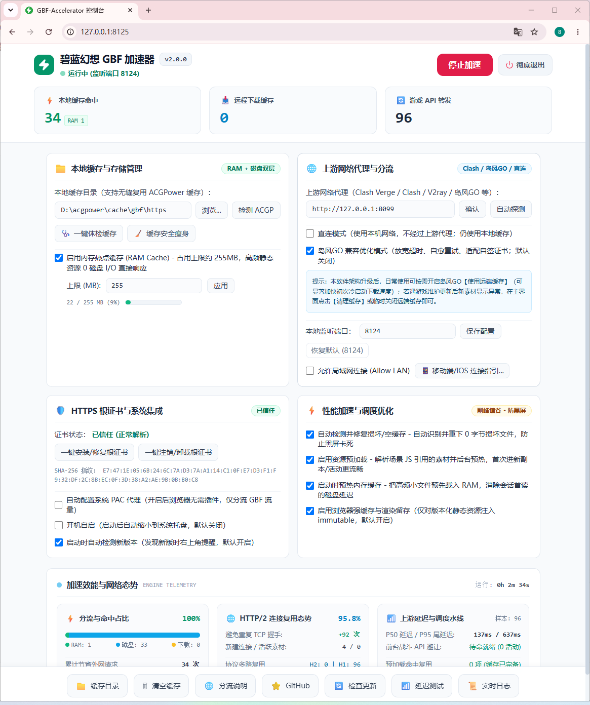
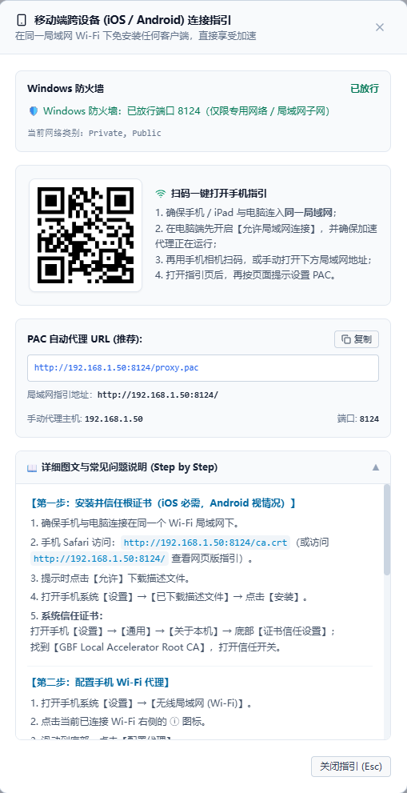
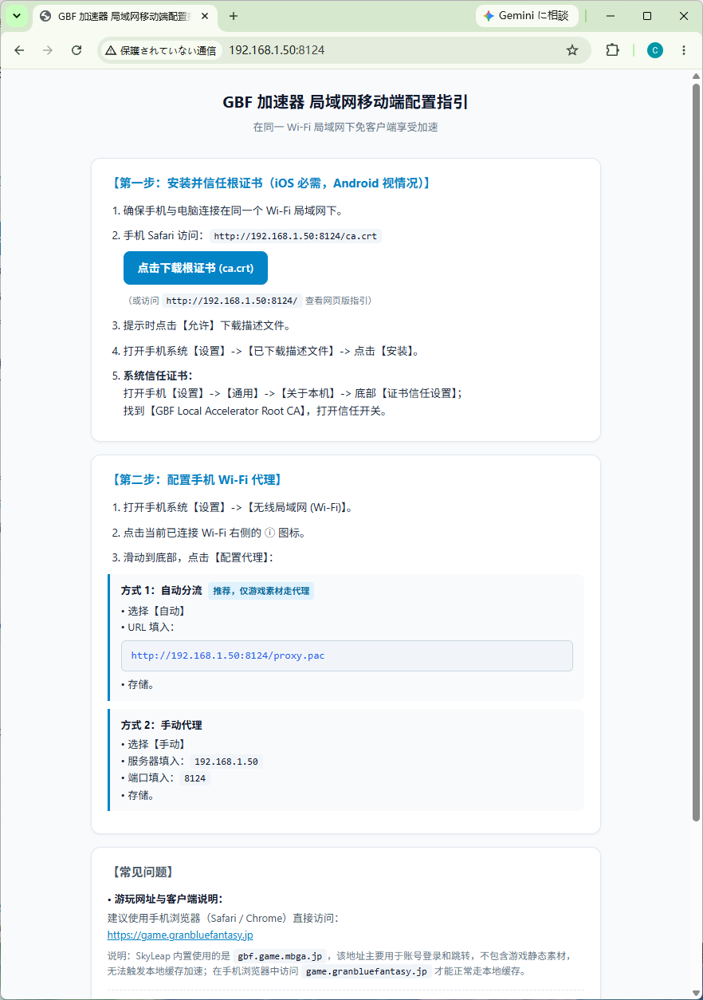
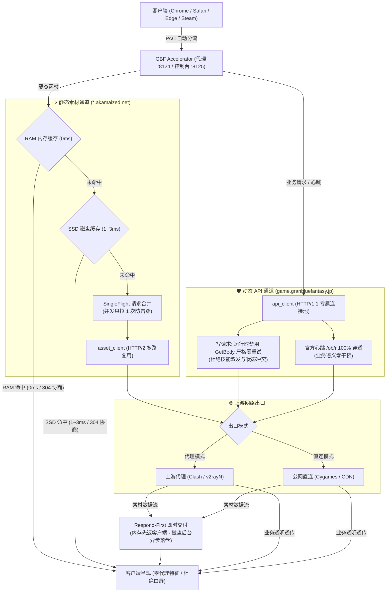

# GBF Accelerator

碧蓝幻想（Granblue Fantasy）高性能本地静态资源缓存与透明代理工具。

[](https://github.com/Sagisawa/GBF-Accelerator/releases)
[](https://go.dev/)
[-informational.svg)]()
[](https://github.com/Sagisawa/GBF-Accelerator/actions/workflows/ci.yml)
[](LICENSE)

通过本地 RAM / SSD 层次化缓存与 HTTP/2 多路复用连接，将游戏静态资源（立绘、音频、战斗动画、脚本）缓存至本地，减少跨海重复下载，降低静态素材加载延迟与上游带宽负载；同时为核心游戏动态 API（战斗、编队、抽卡、结算等）提供独立的 HTTP/1.1 长连接通道，实现业务语义零干预的端到端透明转发。

> 📥 **下载开箱即用版**：前往 [GitHub Releases](https://github.com/Sagisawa/GBF-Accelerator/releases) 获取预构建便携包：
> - **Windows**：下载 `GBF_Accelerator_v2.1.0_GUI.zip`，解压即用。
> - **macOS**：下载 `GBF_Accelerator_v2.1.0_macOS_universal2.zip`（Universal 2 双架构二进制包，同时原生支持 Intel 与 Apple Silicon Macs），解压即用。
> - 各版本详细改动请参阅 [CHANGELOG.md](CHANGELOG.md)。

---

## v2.1.0 发布要点

- **一键更新与自动重启**：控制台可从 GitHub Releases 获取对应平台的正式更新包；下载后自动校验 SHA-256 与压缩包完整性，验证通过后可直接应用更新并重启程序；也可打开下载目录手动处理。
- **备用上游与自动故障转移**：支持配置一个备用 HTTP / HTTPS / SOCKS5 上游，主上游发生连接失败时立即切换；响应持续超过设定阈值并达到连续异常次数后切换；冷却后可自动尝试恢复主上游。功能默认关闭，直连模式下不可用。
- **Windows Root CA 证书流程修复**：首次检测到未信任证书时自动打开安装引导；一键安装恢复 Windows 原生安全确认；注销证书后再次安装也会正常出现确认提示，并增加安装失败与证书存储位置诊断。

## v2.0.0 发布要点

v2.0.0 是 Go 原生引擎与 Web 控制台重构后的正式发布线，发布前最后一轮主要收敛集中在“可用性与状态可观测性”，不再扩大代理数据面功能范围：

- **实时状态显示**：顶部“本地缓存命中 / 远程下载缓存 / 游戏 API 转发”通过 1 秒级 SSE 更新；运行时间仍由独立组件按 1 秒本地计时，避免高频更新驱动整个页面重渲染。
- **系统代理冲突提示**：当检测到外部 PAC 或手动系统代理时，控制台直接显示冲突来源，便于排查 PAC 不生效问题。
- **Windows 局域网防火墙适配**：仅在用户明确操作时创建当前代理端口的入站放行规则，并限制为 Private / LocalSubnet / TCP，不自动扩大 Public 或 Any 暴露范围。
- **Windows 原生体验加固**：Windows 可执行文件原生内嵌完整 7 规格高清应用图标与 PE 版本元数据；优化系统目录唤起防抖与非阻塞执行。
- **移动端全流程指引**：局域网落地页与 Web 控制台集成详尽图文指引（iOS 根证书信任开关、Wi-Fi PAC / 手动分流配置与常见排查）。
- **跨平台边界保持不变**：Windows 提供桌面系统集成与防火墙适配；macOS 保持 Universal 2 与网络设置集成；Linux 继续以无头模式为主。

## 界面预览

| Web 控制台主面板 | 实时网络与转发日志 |
| :---: | :---: |
|  |  |

| 移动端跨设备连接指引 (控制台) | 局域网移动端引导页 (手机浏览器) |
| :---: | :---: |
|  |  |

## 架构设计与数据流向

本工具采用**数据平面（Data Plane）与控制平面（Control Plane）双端口拓扑隔离**设计，兼顾高吞吐静态缓存、端到端透明业务转发与轻量化跨平台管理：

- **数据平面（核心代理，默认 `:8124`）**：负责拦截客户端流量、MITM TLS 终端握手、静态素材多级缓存加速、动态 API 专用池转发以及 PAC/根证书分发；
- **控制平面（管理控制台，默认 `:8125`）**：负责本地 REST API、实时 SSE 遥测流推送与内嵌 React 控制台；自带 DNS 重绑定与 CORS 防护，支持局域网白名单隔离；
- **宿主集成层（Desktop Integration）**：无外部 Python / Electron 依赖，自动托管系统 PAC 代理与证书库，通过本地 Chromium App Mode 挂载原生独立窗口并常驻托盘。

### 核心数据流向图



<details>
<summary>点击查看 ASCII 字符全景图（无图形渲染时备用）</summary>

```text
======================================================================
1. 客户端接入层 (Client & UI)
   ├─ 游戏客户端 (Browser / Steam / AndApp)
   │    └─► PAC / 系统代理分流 ──► [数据平面: 核心代理 :8124]
   └─ 管理终端 (Chromium App 独立窗口 / 浏览器)
        └─► HTTP / SSE 直连 ─────► [控制平面: Web 管理服务 :8125]
======================================================================
2. 控制平面: 管理服务 (:8125) (DNS Rebinding 防护 & 局域网白名单)
   ├─ 内嵌 Web 控制台 (React SPA / Go embed 内置)
   ├─ REST 管理 API (/api/config, /api/status, /api/cache/stats)
   ├─ SSE 实时遥测流 (连接复用状态 / API 延迟分布 / 实时吞吐)
   ├─ 缓存运维引擎 (Magic Bytes 体检 / 历史版本安全瘦身)
   └─ 版本更新引擎 (GitHub Release 异步检测与断点续传)
======================================================================
3. 数据平面: 核心代理 (:8124)
   │
   ├─ [协议分流调度器 (Dispatcher)]
   │    ├─ 明文本地端点 ──► /proxy.pac (PAC) / /ca.crt (根证书) / 局域网向导
   │    ├─ 官方遥测域名 ──► 403 Forbidden 立即阻断 (sp.mbga.jp/telemetry 等)
   │    ├─ 外部无关域名 ──► Passthrough 隧道透传 (透明 TCP / SOCKS5)
   │    └─ GBF 核心域名 ──► MITM TLS 终端握手 (本地独立唯一 CA 动态签发)
   │
   ├─ [静态素材通道 (Asset Channel: *.akamaized.net)]
   │    1. 内存查找 (RAM LRU 0ms)
   │         └─ 未命中 ──► 磁盘查找 (SSD 1~3ms)
   │    2. 缓存命中 ──────► 304 协商 (ETag / If-Modified-Since) ──► 瞬时交付
   │    3. 缓存未命中 ────► SingleFlight 并发请求合并 (防击穿)
   │         └─► asset_client (HTTP/2 多路复用连接池) 回源拉取
   │    4. 二进制检验 ────► Magic Bytes 白名单校验 (拦截 0 字节/错误 HTML)
   │    5. 写入与调度 ────► Respond-First (内存写完即交付 + 后台非阻塞落盘)
   │         └─► Prefetch Engine (15~35ms 随机抖动平滑，遇前台活动主动避让)
   │
   └─ [动态 API 通道 (Dynamic API Channel: game.granbluefantasy.jp)]
        ├─ 专用连接池 ────► api_client (HTTP/1.1 Keep-Alive 专用池)
        ├─ 官方探测穿透 ──► /ob/r (心跳) 与 /rest/error/js (上报) 100% 透传
        ├─ 双重约束重试 ──► POST/写操作: 物理禁用 GetBody 严格零重试
        │                  只读 GET 白名单: 仅限底层断开快速重连 1 次
        └─ 零特征交付 ────► 严格逐行保留 Set-Cookie，无自定义 Header 污染
======================================================================
4. 上游网络出口 (Upstream Gateway)
   ├─ 代理模式 (默认) ──► 上游前置代理 (Clash / v2rayN / 外部 SOCKS5)
   └─ 直连模式 ────────► 公网直连 (Cygames 游戏服 / Akamai CDN)
======================================================================
```
</details>

### 事务与安全边界 (Transaction & Security Boundaries)

明确界定双平面监听策略与暴露边界，守住核心安全红线：

- **8124 = 数据平面 (Data Plane)**
  - 默认监听：`127.0.0.1`
  - 开启局域网共享（`AllowLAN = true`）时：动态重载至 `0.0.0.0`
  - 承载职责与公开端点：
    - HTTP / HTTPS 核心代理与流量分流
    - `/ca.crt`（根证书直接下载）
    - `/proxy.pac`（PAC 自动代理脚本）
    - 局域网移动端接入引导向导页
- **8125 = 控制平面 (Control Plane)**
  - 监听策略：**永远严格绑定 `127.0.0.1`，绝不向局域网暴露（Never exposed to LAN）**
  - 承载职责：
    - 内嵌 Web 管理控制台 React SPA 前端资源
    - 系统管理与配置变更 REST API（`/api/config`、`/api/status`、`/api/app/quit` 等）
    - 实时性能与连接 SSE 遥测流
    - 内置 DNS Rebinding 防护与 Host / Origin 白名单严格校验

### 配置热重载流水线与强事务保障 (Hot-Reload Pipeline & Safe Rollback)

系统配置热重载（`POST /api/config/apply`）遵循严格的四阶段强事务流水线：

```text
[Candidate] (候选配置生成与字段校验)
    ↓
[Commit] (内存配置原子提交与磁盘持久化)
    ↓
[Listener Rebind] (网络监听强事务重载: 8124 / 8125 端口与 Host 切换)
    ↓
[Post-Commit Runtime Sync] (非监听运行时副作用生效: 缓存目录/RAM 上限/PAC 代理/自启)
```

- **Save/Commit 阶段失败**：监听器尚未变更，内存配置回滚，磁盘配置保持不变，且**彻底阻断 Listener 与 Post-Commit 运行时副作用**；
- **Rebind 阶段失败**：已成功重绑的 Listener 与配置自动回滚至旧状态，并返回明确错误；
- **语义约束**：`cfgMgr.Update()` 仅用于安全的内存就地原子更新；`cfgMgr.Commit()` 承载包含磁盘落盘校验、两端监听联动与强事务回滚保障的完整语义。

---

## 核心功能矩阵

### ⚡ 极速双通道与流控
- **动态 API / 静态素材双通道物理隔离**：
  - **动态 API 通道 (`api_client`)**：为 `game.granbluefantasy.jp` 专设独立 HTTP/1.1 连接池，保持长连接复用，避免连接反复握手延迟。
  - **静态素材通道 (`asset_client`)**：针对 Akamai CDN 启用 HTTP/2 多路复用，通过单条链路并发拉取多路素材切片。
  - **连接池互不影响**：后台预加载批量并发拉取素材时，动态 API 维持专属连接，避免与静态流量产生连接竞争。
- **Go 运行时低延迟网络调优**：
  - 启动时自动将 `debug.SetMemoryLimit`（软内存上限）设为 `RAMCacheMaxMB + 128MB`，配合 `debug.SetGCPercent(200)` 调优 GC 步调；
  - 减少高并发网络 I/O 期间的垃圾回收频次与 STW 停顿，保障低延迟网络热路径平稳。
- **前台素材优先调度与 QoS 避让**：
  - 动态跟踪前台活动请求，当前台拉取首屏与战斗画面素材时，后台预加载任务主动暂停让道；
  - 前台请求完毕后增加短时冷却平滑，避免后台预加载立即恢复引发瞬时突发流量。
- **双重约束安全重试 (Safe Stale-Retry)**：
  - **写请求严格零重试**：所有涉及状态变更的 POST 请求（普通攻击、技能释放、召唤、购买等）最大尝试次数严格为 1，并在运行时显式置空 `upReq.GetBody`，从底层杜绝 Go 标准库隐式重发。
  - **只读白名单断连重试**：仅对预先严格审核的只读幂等 GET 接口（如 `/rest/multiraid/condition.json`、`/rest/quest/stage_list`、`/rest/party/deck_info` 等），在遇到底层空闲长连接断开（`EOF` / `connection reset`）时执行最多 1 次快速重连；多人战开本发车与战斗等写操作坚决零重试。
- **SSE 实时遥测与监控**：
  - 通过 Server-Sent Events (SSE) 长连接将连接复用状态（`reused` / `new`）、吞吐速率与 API 耗时分布（P50 / P95 / P99）实时推流至 Web 控制台；
  - 支持按接口模块筛选，提供一键导出审计日志能力。

### 💾 层次化缓存体系与预加载
- **RAM Cache 内存热点缓存**：高频静态资源直接驻留内存（默认上限 256MB，可在 16MB ~ 8192MB 自由调节），读取耗时接近 0ms，读取不经磁盘。
- **Respond-First 写入交付引擎**：回源拉取素材完毕后优先写入 RAM Cache 并立即向客户端交付响应，磁盘落盘完全置于后台非阻塞异步执行，避免文件 I/O 阻塞网络交付。
- **SSD 持久化缓存与原子写入**：静态资源落盘采用临时文件（`.tmp`）与原子重命名机制，防止进程异常中断导致缓存破损。
- **304 Not Modified 条件协商缓存**：支持客户端 `If-None-Match` (ETag) 与 `If-Modified-Since` 校验，本地缓存命中时瞬时返回 304 响应，零实体字节传输。
- **智能 Cache-Control 分级**：针对带版本号的素材切片（`reVersioned`）返回 `immutable, max-age=31536000`，有效利用浏览器本地磁盘缓存；常规文件返回受控缓存头。
- **Magic Bytes 二进制校验与一键体检**：校验 PNG / JPEG / WebP / GIF / MP3 / WOFF 等二进制文件头，拦截 0 字节损坏文件及 502/503 错误 HTML；GUI 提供“一键体检缓存”支持坏件清理与自动回源自愈。
- **SingleFlight 并发请求合并**：同名静态素材高并发请求时自动合并为单次回源拉取，其余请求共享返回结果，缓解上游并发压力。
- **后台平滑预加载 (Prefetch)**：解析场景 JS/JSON 及 CreateJS 角色动画切片，在任务间引入 15~35ms 随机抖动平滑调度，削峰填谷；引用扫描解耦至后台有界队列，不阻塞前台请求。
- **启动内存预热**：冷启动预热扫描上限优化为 1500 项，优先载入核心 JS/CSS、字体与高频 UI 图标，启动扫描耗时保持在 1.5 ~ 2.5 秒。
- **历史缓存平滑复用与兼容**：网络抖动或上游超时时，自动寻找本地已有旧版本静态资源平滑兜底，避免素材加载失败白屏；支持复用已有历史缓存目录（如 ACGPower 历史缓存）。
- **历史版本缓存安全瘦身 (Cache Slim)**：提供按保留版本数（默认保留最新 8 个版本）清理未命中旧版本素材目录的安全轮转机制，配合实时 SSE 进度展示与取消控制，防止长期使用磁盘无序膨胀。

### 🖥️ 跨平台原生集成
- **Windows 原生集成**：
  - 基于 Chromium App Mode 的无边框独立控制台窗口与原生深色主题，零 Electron / Python 运行时依赖；
  - 可执行文件原生内嵌 7 规格高清应用图标与 PE 版本元数据；
  - 自动管理 WinINet 系统 PAC 代理；
  - 系统代理冲突可视化：检测到外部 PAC 或手动系统代理时，在控制台直接显示冲突来源并提供一键修复引导；
  - Windows 局域网防火墙适配：可通过控制台一键安全适配本地入站规则，严格限定为 Private + LocalSubnet + TCP + Inbound + Allow；
  - 启动时自动检测并清理端口占用与残留僵尸进程（`clean_zombies`）；
  - 支持常驻系统托盘，后台运行时挂起界面刷新，CPU 占用降至接近 0.0%；
  - 内置 Windows 证书库信任管理（`certutil` 自动导入/注销），首次未安装时自动打开证书引导，并保留 Windows 原生安全确认；
  - 支持随 Windows 开机自启（默认关闭）。
- **macOS 原生集成**：
  - 采用 Universal 2 双架构二进制打包，同时原生支持 Intel 与 Apple Silicon (M系列) Macs；
  - 基于 Chromium App Mode 启动独立应用窗口，支持顶部状态栏常驻图标与上下文菜单；
  - 自动调用 `networksetup` 托管系统 PAC 代理，具备外部代理冲突检测；
  - 自动调用 `security add-trusted-cert` 信任用户登录钥匙串（Keychain）；
  - 提供 `start_proxy.sh` 快捷启动与 `install_ca.sh` 一键证书管理；
  - 支持写入 LaunchAgents 用户自启服务。
- **Linux / 无头环境 (nogui)**：
  - 提供轻量化纯命令行模式运行（`go run . --headless` 或编译二进制加 `--headless` 参数），适用于 Linux 虚拟机或无图形界面服务器；
  - 详细指引请参阅 [docs/MAC_LINUX_NOGUI.md](docs/MAC_LINUX_NOGUI.md)。
- **局域网共享与移动端支持**：
  - 可在设置中开启“允许局域网连接”，支持同一局域网下的 iPhone / iPad / Android 设备接入；
  - 手机访问 `http://<局域网IP>:8124/` 直达移动端专属向导页，提供一键复制 PAC 链接与扫码下载证书；
  - 内置私网 IP 访问控制列表（ACL）防护，防止非局域网非法访问。
### 🔀 备用上游与自动故障转移
- **可选备用上游**：主上游之外可单独配置备用代理，支持 `http://`、`https://`、`socks5://`、`socks5h://`，也支持填写 `direct` 作为故障时的本机直连备选。
- **分级故障判定**：连接拒绝、连接超时等硬连接错误立即切换；上游响应超过设定阈值时累计异常次数，达到连续异常水线后切换。
- **恢复策略可配置**：冷却时间结束后可自动尝试主上游；恢复探测成功则切回主上游，失败则继续使用备用上游。
- **默认不干预现有配置**：备用上游与自动切换默认关闭；直连模式下不启用故障转移。

- **客户端内置版本更新检测**：
  - 启动时异步比对 GitHub Releases 版本，支持根据操作系统（Windows / macOS）自动筛选对应发布包并提供一键下载与断点续传；
  - 更新包下载完成后自动校验官方 SHA-256 与归档完整性；校验通过可直接应用更新并自动重启，缺少可验证校验值时保持手动下载路径。

### 🛡️ 安全、零篡改与透明治理
- **业务语义绝对透明**：所有业务接口（抽卡、编队、结算、任务等）通过专用通道端到端原样转发，严禁修改状态码、业务 Header、正文或 Cookie；严格保留多行 `Set-Cookie`，禁止逗号折叠。
- **官方探测绝对穿透**：官方在线心跳（`/ob/r`）与前端错误上报（`/rest/error/js`）100% 穿透直达 Cygames 服务器，本地不拦截、不伪造。
- **官方遥测与数据搜集精准阻断**：对 `sp.mbga.jp/telemetry`、`log.granbluefantasy.jp` 等非业务数据搜集域名进行 403 Forbidden 主动阻断，保护隐私并降低网络杂讯。
- **控制平面安全隔离 (DNS Rebinding 防护)**：控制端口严格校验 HTTP `Host` 与 `Origin` 头（非白名单直接拒绝），杜绝第三方恶意网页通过本地端口实施 DNS 重绑定或跨域提权反弹。
- **响应头零指纹污染**：向客户端交付的所有响应中，严禁添加任何自定义代理标识头（如 `X-Proxy-*` 等），保持标准透明传输中间件定位。
- **本地独立唯一根证书**：根证书私钥仅在首次运行时由本机动态生成，严格保存在本地 `certs/` 目录，不使用任何硬编码或公开共享证书；域名证书通过 SAN 严格限制在 GBF 相关域名，符合 Apple TLS 规范（有效期 <= 365 天）。
- **精准收敛分流规则**：PAC 脚本精准收敛至 GBF 官方站点、标准 CDN 与 Steam 版 CDN，不通配公共 `*.akamaized.net`，不干扰非 GBF 流量。

---

## 快速上手

### 方式一：使用预构建便携版（推荐）

#### Windows 用户
1. 前往 [Releases 页面](https://github.com/Sagisawa/GBF-Accelerator/releases) 下载最新便携包 `GBF_Accelerator_v2.1.0_GUI.zip`。
2. 解压到任意非中文路径（例如 `D:\GBF_Accelerator\`）。
3. **准备上游网络**：确保你的代理软件（Clash Verge / Clash / v2rayN 等）已开启并正常翻墙联网（若有日本专线也可在界面中勾选【直连模式】）。
4. **启动程序**：双击运行 `GBF_Accelerator.exe`。
   > 💡 **未签名安全提示**：由于开源软件未采购昂贵的商业代码签名证书，首次运行若弹出 Windows Defender SmartScreen「Windows 已保护你的电脑」提示，请点击**【更多信息】**（More info）并选择**【仍要运行】**（Run anyway）。
5. **安装 HTTPS 根证书（【必做】，仅首次需执行）**：
   - 在自动打开的控制台界面顶部点击**【一键安装根证书】**（或双击运行目录下的 `install_ca.bat`）；
   - 在 Windows 安全警告弹窗中点击**【是】**确认信任（用于安全解析与本地缓存 Akamai CDN 静态素材，不安装会导致素材加载报证书错误或白屏）；
   - **【关键步骤】安装后完全重启浏览器**：若当前浏览器已开启，**请务必彻底关闭所有浏览器窗口并重新打开**（Chromium 会缓存系统证书库与历史握手状态，必须重启浏览器重新加载系统根证书，避免访问游戏时报错“证书不受信任”或白屏）。
6. **配置浏览器分流**：
   - **插件分流（强烈推荐，永不漏分片）**：在 ZeroOmega / SwitchyOmega 扩展中新建【PAC 情景模式】，PAC 网址填入 `http://127.0.0.1:8124/proxy.pac`，保存后在扩展图标切换为该模式即可。
   - **系统代理（免插件）**：在软件界面直接勾选【自动配置 Windows 系统 PAC 代理】（若安装了 SwitchyOmega，插件图标需切到 `[系统代理]` 或停用插件）。
7. **开始游戏与加速确认**：浏览器直接打开 `https://game.granbluefantasy.jp` 开始游玩（勿通过 SkyLeap 的 `gbf.game.mbga.jp` 登录地址游玩，该地址不走素材缓存）。
   > 💡 **缓存命中技术说明**：首次游玩新副本时素材经网络首次下载并写入加速器本地磁盘缓存；**同一浏览器会话短时间内重复游玩时，现代浏览器自带的 Memory Cache（内存缓存）会直接在内部交付（开发者工具 Network 显示 from memory cache），根本不会向外部网络或本地代理发请求**。因此，只有游玩一段时间后（浏览器内部内存缓存置换淘汰）、重启浏览器、或第二天再次进入相同副本时，请求才会由加速器本地缓存（RAM 0ms / SSD 1~3ms）极速交付，控制台顶部的【本地缓存命中】数字会快速跳动增加。

#### macOS 用户
1. 前往 [Releases 页面](https://github.com/Sagisawa/GBF-Accelerator/releases) 下载 `GBF_Accelerator_v2.1.0_macOS_universal2.zip`（Universal 2 双架构独立 `.app` Bundle，同时原生支持 Intel 与 Apple Silicon Macs）。
2. 解压并将 `GBF_Accelerator.app` 拖入系统的【应用程序】文件夹。
   > 💡 **Gatekeeper 提示**：首次打开若提示“无法验证开发者”或“已损坏”，请按住 Control 键并鼠标右键点击应用选择【打开】；或在终端执行 `xattr -cr /Applications/GBF_Accelerator.app` 解除系统隔离。
3. 确保 Clash / Surge 等上游代理正常运行。
4. 启动后程序会自动打开内嵌 Web 控制台，首次运行点击**【一键安装根证书】**，输入 Mac 密码或按触控 ID 允许信任钥匙串。**安装后请按 `Cmd + Q` 完全退出并重新打开浏览器**以重载证书库。
5. 在浏览器扩展中新建 PAC 情景模式指向 `http://127.0.0.1:8124/proxy.pac`（或勾选系统 PAC），即可在 Safari 或 Chrome 中流畅游玩。

---

### 方式二：从源码运行

#### 环境要求
- **Go 1.21+**（推荐 1.22 / 1.23）
- Windows 10/11 或 macOS 12+ 或 Linux
- **Node.js 18+**（可选，仅当需要重新构建 `web/` 前端 SPA 页面时需要）

#### Windows 源码运行
```powershell
# 1. 克隆代码仓库
git clone https://github.com/Sagisawa/GBF-Accelerator.git
cd GBF-Accelerator

# 2. 进入 engine 目录直接运行 Go 原生引擎（自带内嵌 Web 控制台）
cd engine
go run .
```

#### macOS 源码运行
```bash
# 1. 克隆代码仓库
git clone https://github.com/Sagisawa/GBF-Accelerator.git
cd GBF-Accelerator

# 2. 首次使用安装/信任本地根证书
./install_ca.sh

# 3. 启动程序
./start_proxy.sh
# 或直接运行: cd engine && go run .
```

#### Linux / 无头服务器运行 (nogui)
在无桌面环境的 Linux 服务器或容器中，可使用纯命令行无头模式：
```bash
cd engine
go run . --headless
```
> 详细的环境依赖、证书导入与浏览器配置步骤，请参阅专用指南：[docs/MAC_LINUX_NOGUI.md](docs/MAC_LINUX_NOGUI.md)。

#### 常用命令行参数 (CLI Flags)
无论是桌面环境还是服务器环境，均支持通过命令行参数动态覆盖配置：

```bash
# 查看版本号
./GBF_Accelerator -v

# 常用参数一览
./GBF_Accelerator \
  -proxy-port 8124 \         # 核心代理监听端口 (默认 8124)
  -control-port 8125 \       # Web 控制台与管理 API 端口 (默认 8125)
  -upstream-proxy "http://127.0.0.1:7897" \ # 指定上游代理地址
  -cache-dir "/path/to/cache" \             # 自定义静态素材落盘根目录
  -allow-lan \               # 允许局域网设备接入代理 (监听 0.0.0.0)
  -direct-mode \             # 开启直连模式 (不经上游代理)
  -headless \                # 无头后台模式 (不启动托盘与独立窗口)
  -open-browser \            # 启动后自动在默认浏览器打开控制台
  -minimized                 # 启动后直接最小化至系统托盘
```

---

## 配置文件说明

首次运行后会在程序根目录下生成 `config.json`，可在图形界面中配置，也可直接编辑：

```json
{
  "listen_host": "127.0.0.1",
  "listen_port": 8124,
  "control_port": 8125,
  "allow_lan": false,
  "upstream_proxy": "auto",
  "direct_mode": false,
  "cache_dir": "auto",
  "clean_zombies": true,
  "auto_system_proxy": false,
  "auto_start": false,
  "enable_ram_cache": true,
  "ram_cache_max_mb": 256,
  "enable_browser_cache": true,
  "enable_auto_repair": true,
  "enable_prefetch": true,
  "enable_ram_warmup": false,
  "ram_warmup_max_items": 1500,
  "verify_upstream_tls": true,
  "shimakaze_mode": false,
  "auto_check_update": true,
  "api_max_connections": 16,
  "api_max_keepalive": 4,
  "api_keepalive_expiry": 20.0,
  "asset_max_connections": 32,
  "asset_max_keepalive": 16,
  "asset_keepalive_expiry": 60.0,
  "enable_api_telemetry": true
}
```

| 配置项 | 类型 | 默认值 | 说明 |
| :--- | :--- | :--- | :--- |
| `listen_host` | 字符串 | `"127.0.0.1"` | 保留配置字段；实际监听地址由 `allow_lan` 统一控制，开启后运行时使用 `0.0.0.0`。 |
| `listen_port` | 整数 | `8124` | 本地代理服务监听端口（核心网络分流）。 |
| `control_port` | 整数 | `8125` | Web 控制台与本地管理 REST API 端口（仅限本机回环访问）。 |
| `allow_lan` | 布尔 | `false` | 是否允许局域网内其他设备接入加速服务。 |
| `upstream_proxy` | 字符串 | `"auto"` | 上游代理地址；`"auto"` 自动探测 7897/7890/8123/10808/10809 端口，也可指定为 `"http://127.0.0.1:7897"` 等。 |
| `direct_mode` | 布尔 | `false` | 直连模式；开启后绕过上游代理直接请求，但本地静态缓存继续生效。 |
| `cache_dir` | 字符串 | `"auto"` | 静态素材磁盘落盘目录；`"auto"` 自动检测已有 ACGPower 缓存或使用程序目录下的 `cache/gbf/https`。 |
| `clean_zombies` | 布尔 | `true` | 启动时自动检查并清理因异常退出残留的历史孤儿代理进程。 |
| `auto_system_proxy` | 布尔 | `false` | 是否自动挂载系统 PAC 代理（Windows WinINet / macOS networksetup）。 |
| `auto_start` | 布尔 | `false` | 是否随系统开机自启并最小化（默认关闭）。 |
| `enable_ram_cache` | 布尔 | `true` | 是否启用 RAM 内存热点缓存。 |
| `ram_cache_max_mb` | 整数 | `256` | RAM 缓存容量上限（MB），支持范围 16 ~ 8192。 |
| `enable_browser_cache` | 布尔 | `true` | 是否对带版本哈希的静态资源注入 `immutable` 强缓存标头。 |
| `enable_auto_repair` | 布尔 | `true` | 自动检测并清理损坏/0字节的静态资源缓存并回源修复。 |
| `enable_prefetch` | 布尔 | `true` | 启用后台资源平滑预加载（15~35ms 抖动调度，前台活动主动让道）。 |
| `enable_ram_warmup` | 布尔 | `false` | 启动时是否预热高频静态素材至 RAM 缓存。 |
| `ram_warmup_max_items` | 整数 | `1500` | 启动预热扫描素材数量上限，平衡启动耗时与热点命中。 |
| `verify_upstream_tls` | 布尔 | `true` | 请求上游时是否校验 TLS 证书安全性。 |
| `shimakaze_mode` | 布尔 | `false` | 岛风 GO / ACGPower 兼容优化模式（适配自签证书与超时参数，放行证书）。 |
| `auto_check_update` | 布尔 | `true` | 启动时是否自动检查 GitHub Releases 最新版本。 |
| `api_max_connections` | 整数 | `16` | 动态 API 专属连接池最大连接数。 |
| `api_max_keepalive` | 整数 | `4` | 动态 API 连接池空闲长连接保留数。 |
| `api_keepalive_expiry` | 浮点 | `20.0` | 动态 API 空闲长连接保活超时（秒）。 |
| `asset_max_connections` | 整数 | `32` | 静态素材通道最大并发连接数（HTTP/2 多路复用，推荐保守水线 <= 32）。 |
| `asset_max_keepalive` | 整数 | `16` | 静态素材通道空闲长连接保留数（推荐保守水线 <= 16）。 |
| `asset_keepalive_expiry` | 浮点 | `60.0` | 静态素材通道空闲长连接保活超时（秒）。 |
| `enable_api_telemetry` | 布尔 | `true` | 是否启用 API 响应耗时分布（P50/P95/P99）及连接复用率遥测。 |

---

## 常见问题排查 (Practical FAQ)

### Q1: 浏览器打开游戏页面提示“证书不受信任”或 `NET::ERR_CERT_AUTHORITY_INVALID`？
- **原因**：本地代理需要对 HTTPS 静态资源进行本地缓存分流，首次使用时需要信任本机独立生成的根证书。
- **排查与解决**：
  - **Windows 用户**：
    1. 在图形界面点击【安装根证书】按钮，在弹出的 Windows 安全警告窗口中点击【是】；
    2. 或右键管理员身份运行根目录下的 `install_ca.bat`；
    3. **务必完全退出并重启浏览器**（关闭所有窗口并重新打开，使浏览器重载系统证书信任库）。
  - **macOS 用户**：
    1. 运行根目录下的 `./install_ca.sh`，脚本会自动导入至当前用户登录钥匙串并设置信任；
    2. 若系统提示输入密码，请输入 Mac 开机密码以完成授权；
    3. 在 Chrome / Safari 中按 `Cmd + Q` 完全退出浏览器后重新打开。
  - **Firefox 用户**：Firefox 采用独立证书库，需在 Firefox【设置】→【隐私与安全】→【证书】→【查看证书】→【证书颁发机构】中导入 `certs/ca.crt`，并勾选“信任由此证书颁发机构标识的网站”。

### Q2: 上游代理（Clash / v2rayN / 岛风GO）端口如何配置？“自动探测”未找到怎么办？
- **常见上游代理默认端口**：
  - Clash Verge (Rev): `7897`
  - Clash for Windows / 标准 Clash: `7890`
  - v2rayN: `10809` (HTTP) / `10808` (SOCKS5)
  - 岛风GO: `8099` (HTTP)
  - ACGPower: `8123` (HTTP)
- **手动设置**：在主界面【上游代理端口】输入框中填入你所使用的代理客户端对应端口（例如 `7897`）。
- **测试连通性**：点击【测试连通性】或【上游延迟】按钮，确认往返延迟正常。如果测试失败，请检查代理客户端是否正常启动并处于开启系统代理或服务模式。
- **直连场景**：若身处海外网络或直连延迟优良，可直接勾选【直连模式】，程序将跳过上游代理直接请求服务器，同时保留本地静态缓存。

### Q3: macOS 提示“应用程序已损坏，无法打开”或被 Gatekeeper 拦截？
- **原因**：macOS Gatekeeper 会对未经过 Apple 开发者签名的开源分发包附加隔离属性（Quarantine Attribute）。
- **解决方法**：
  打开终端（Terminal），执行以下命令清除隔离属性：
  ```bash
  # 若已移动到“应用程序”目录：
  sudo xattr -cr /Applications/GBF_Accelerator.app

  # 若解压在“下载”目录：
  xattr -cr ~/Downloads/GBF_Accelerator.app
  ```
  或者按住 `Control` 键点击应用程序图标，在右键菜单中选择【打开】，并在系统确认对话框中点击【打开】即可。

### Q4: 如何复用 ACGPower 或旧版本加速器的历史缓存？
- **自动识别**：GBF Accelerator 启动时会自动扫描常见路径下的 ACGPower 缓存目录（如 `D:\acgpower\cache\gbf\https`），若找到会自动提示一键切换复用。
- **手动指定**：
  1. 在主界面【缓存目录】点击【浏览】；
  2. 选择你原本存放 ACGPower 或旧版本缓存的根目录或 `https` 目录；
  3. 程序会自动标准化路径并挂载，无需重复跨海下载数十 GB 的静态素材文件。
- **缓存健康检查**：若历史缓存中存在损坏或不完整文件，可点击主界面的【一键体检缓存】按钮，程序将通过 Magic Bytes 文件头校验快速扫描并隔离异常文件，随后在游戏需要时自动重新拉取正确版本。

### Q5: 手机或 iPad 等移动设备如何连接本地加速？
1. 确保手机/平板与运行加速器的电脑处于**同一局域网（同一 Wi-Fi）**。
2. 在电脑端控制台界面中勾选【允许局域网连接】。
3. 获取电脑在局域网中的 IP 地址（例如 `192.168.1.100`）。
4. **方式一（推荐，移动端专属引导页）**：
   在手机 Safari 或 Chrome 浏览器中直接访问 `http://192.168.1.100:8124/`，即可打开专属移动端配置页面，页面提供一键复制 PAC 链接与证书下载按钮。
5. **方式二（系统 Wi-Fi 代理设置）**：
   在手机 Wi-Fi 设置中，找到当前连接的 Wi-Fi 并配置代理：
   - **自动代理（PAC）**：选择【自动】，URL 填写 `http://192.168.1.100:8124/proxy.pac`。
   - **手动代理**：选择【手动】，服务器填写 `192.168.1.100`，端口填写 `8124`。
6. 首次接入时访问 `http://192.168.1.100:8124/ca.crt` 下载并安装根证书，并在系统【通用】→【关于本机】→【证书信任设置】中开启对该证书的完全信任。


### Q6: 开启系统 PAC 后提示“检测到系统代理冲突”怎么办？
- **含义**：程序检测到当前系统中存在其他 PAC 脚本或手动 HTTP / HTTPS / SOCKS 代理配置。
- **处理方式**：先确认是否正在使用 Clash、v2rayN、Surge 等其他代理工具；如需使用 GBF Accelerator 的系统 PAC，请避免让多个工具同时管理同一套系统代理配置。
- **安全边界**：程序仅提供诊断提示，不会擅自覆盖其他软件设置。Windows 的防火墙适配也必须由用户明确触发，不会因开启局域网共享而自动修改系统防火墙。

### Q7: 为什么短时间内打两次同一个副本，控制台的【本地缓存命中】数字没有立即增加？
- **原因**：现代 Chromium 浏览器（Chrome、Edge 等）内置了两级缓存体系。在首次下载静态素材后，浏览器自身会在标签页进程内存中保留副本（Memory Cache）。短时间内再次需要该素材时，浏览器直接由内存瞬间交付，**根本不会向本地代理端口发起任何 HTTP 请求**（开发者工具 Network 面板显示 `from memory cache`）。
- **如何观察命中**：只有当游玩一段时间后（内存副本被浏览器置换淘汰）、彻底重启浏览器、或者次日重新游玩时，浏览器才会向代理重新请求素材，此时加速器的高速 RAM LRU 与本地磁盘缓存才会全部接管，命中计数将快速增加。若想快速验证加速效果，可完全重启浏览器后重新进入曾打过的副本观察控制台监控。

---

## 开发与构建

### 运行测试套件
项目配备了覆盖核心代理、双通道隔离、SingleFlight 并发合并、只读失效重试、Magic Bytes 校验、进程单例防重与跨平台更新逻辑的 Go 自动化全量测试套件与静态检查：
```powershell
# 进入 engine 目录执行全量单元测试与静态代码检查
cd engine
go test -v ./...
go vet ./...
```

#### 自动化测试矩阵 (Test Matrix)

| 测试项 (Test) | 状态 (Status) | 说明 |
|:---|:---:|:---|
| `go test -count=1 ./...` | **PASS** | 覆盖全部 13 个 Go 核心功能包单元测试，无缓存全量通过 |
| `go test -race -count=1 ./...` | **PASS** | 并发竞争检测（CI / CGO 环境） |
| `go vet ./...` | **PASS** | 静态代码分析与语法合规检查通过，零告警 |
| Proxy → Control rollback | **PASS** | 代理端口重绑成功但控制端口重绑失败时，代理端口与监听地址原子回滚 |
| Save failure rollback | **PASS** | 磁盘配置持久化失败时两端 Listener 均回滚，且完全阻断 Post-Commit 运行时副作用 |
| Existing connection survival | **PASS** | 监听地址动态重载期间，已建立的 HTTP Keep-Alive 连接平滑存活不受打断 |
| Real LAN interface socket E2E | **PASS** | 真实物理/虚拟网卡局域网 IP（非 loopback）端到端 Socket 拨号与 HTTP 交付通过 |
| Control-plane LAN isolation | **PASS** | `AllowLAN=true` 时物理 LAN-IP 访问 8125 端口严格连接拒绝，守住安全红线 |

#### 验证边界 (Verification Boundaries)

- **已验证 (Verified)**：
  - Windows 10 / 11 真实桌面环境、WinINet 系统 PAC 代理托管、系统托盘常驻与 Chromium App Mode 独立窗口
  - Linux amd64 与 arm64 交叉编译无头运行（nogui）
  - Darwin amd64（Intel）与 Darwin arm64（Apple Silicon）跨平台交叉编译及符号表校验
  - 本机真实非 loopback 局域网 IP（物理 NIC / 虚拟网卡）端到端 Socket 监听、连接与数据链路验证
  - macOS 实机 Universal2 双架构包加载与 Gatekeeper 隔离属性清除
- **未验证 (Unverified)**：
  - 跨物理设备 Wi-Fi E2E（不同物理硬件设备通过无线 Wi-Fi 路由器的端到端真机联调，受路由器 AP 隔离与局域网防火墙策略影响，需在具体网络拓扑下实机验证）

### 打包为独立可执行文件 / 便携发布包

- **Windows**（编译原生单二进制并打包便携发布包）：
  ```powershell
  # 常规打包
  .\build.ps1

  # 若修改了 web/ 前端代码，需同步重新编译 React SPA
  .\build.ps1 -RebuildWeb
  ```
  打包完成后，可执行文件位于 `bin/GBF_Accelerator.exe`，发布包位于 `release/GBF_Accelerator_v2.1.0_GUI.zip`。

- **macOS / Linux**（编译 Universal 2 双架构二进制并打包）：
  ```bash
  # 常规发布打包
  ./build.sh --release

  # 若修改了 web/ 前端代码，需同步重新编译 React SPA
  ./build.sh --rebuild-web --release
  ```
  打包完成后，通用二进制位于 `bin/GBF_Accelerator_darwin_universal`，发布包位于 `release/GBF_Accelerator_v2.1.0_macOS_universal2.zip`，原生双兼容 Apple Silicon（M 系列）与 Intel 芯片。

> ⚠️ **发布构建说明**：macOS Universal 2 正式发布包（融合 arm64 与 amd64）必须在具备 `lipo` 工具的 macOS 主机环境下打包生成。在缺乏 `lipo` 的环境（如 Windows）运行 macOS 打包将严格报错并中断，杜绝输出单架构伪装包。

---

## 安全与技术说明

- **根证书本地隔离管理**：本机根证书仅在首次运行时本地生成，私钥严格保存在本地 `certs/` 目录不外泄。主界面实时展示证书的 SHA-256 指纹，并提供注销/卸载根证书功能，方便随时清理受信任根证书。
- **精准域名分流控制**：PAC 脚本及代理路由严格限制为 GBF 主站域名、标准版 CDN 与 Steam 版专用 CDN（`prd-game-a*-granbluefantasy-steam.akamaized.net`），不通配公共 `*.akamaized.net`，不接管非 GBF 流量。
- **缓存原子落盘与完整性校验**：静态资源下载采用临时文件（`.tmp`）及原子重命名重试机制，防止写入意外中断产生损坏文件；通过文件头校验拦截伪装成静态资源的错误 HTML 响应。
- **动态 API 原样透明转发与心跳直达**：所有动态接口（抽卡、编队、结算、`/ob/r` 在线心跳、`/socket/` 多人战等）均原样透传，不篡改业务正文、不伪造任何 Mock 响应，保留原生 CORS 响应头与多行 `Set-Cookie`。
- **免责声明**：本软件为开源网络辅助与本地静态资源缓存工具，不篡改任何游戏数据、前端脚本或内存。请遵守 Cygames 最终用户许可协议，使用风险自负。
