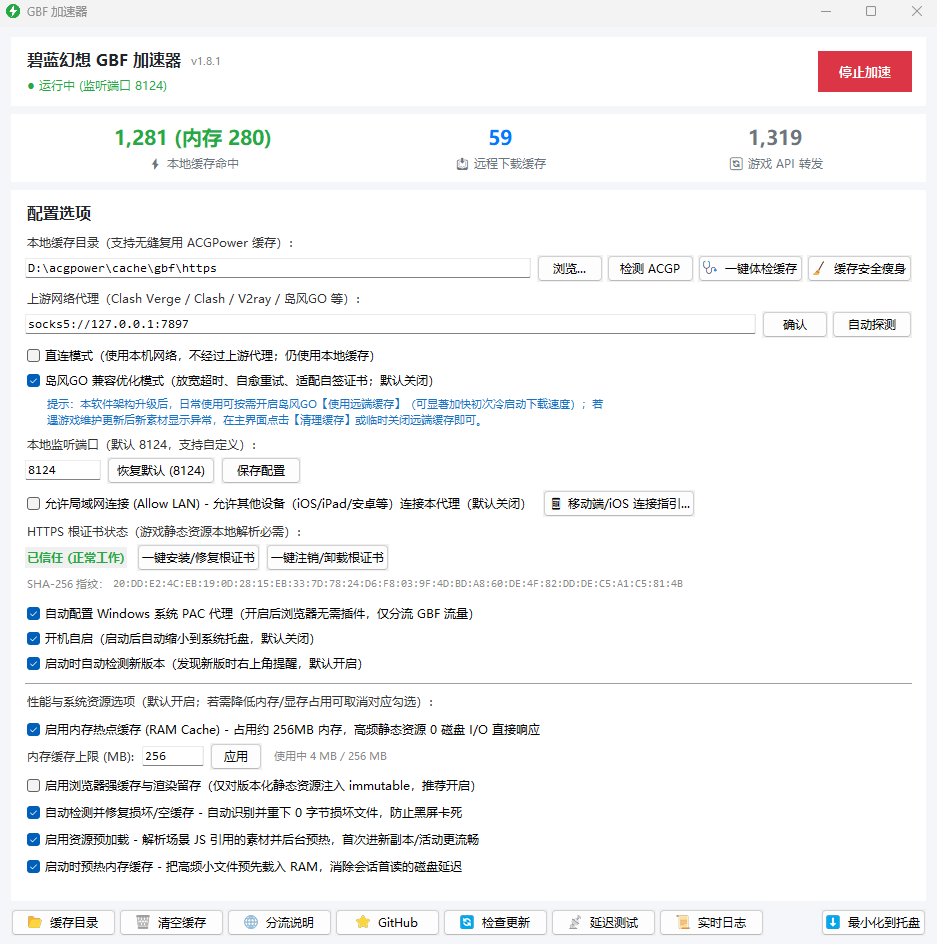
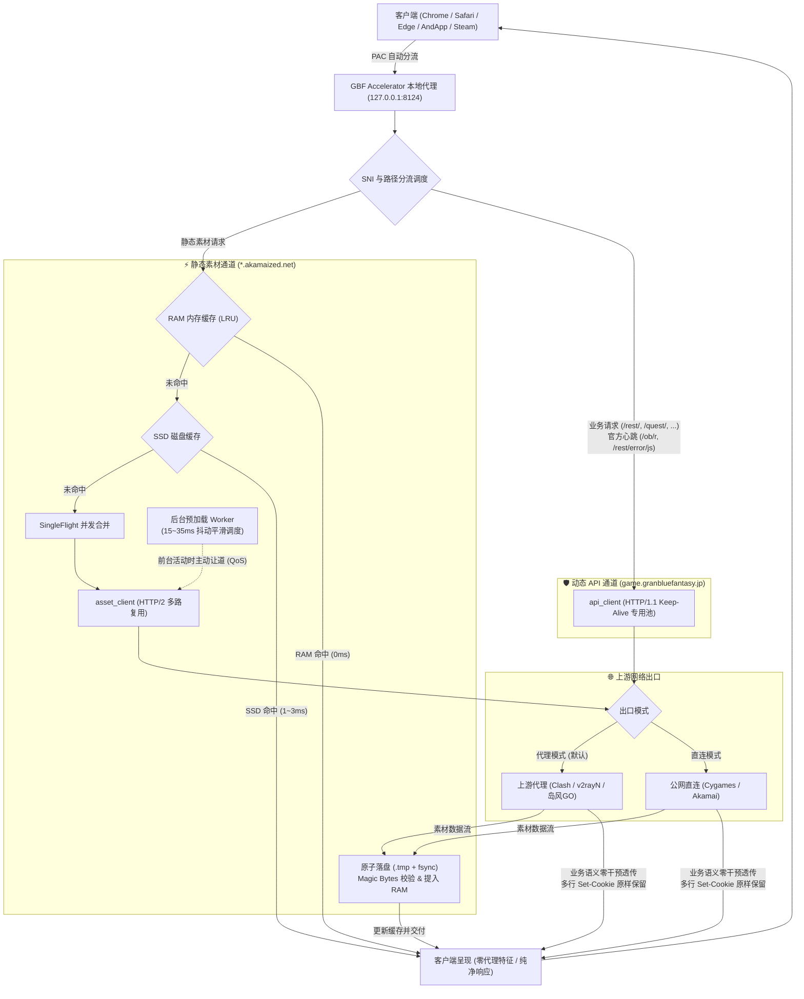
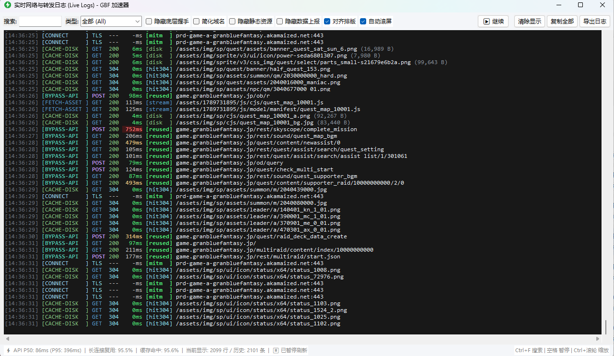
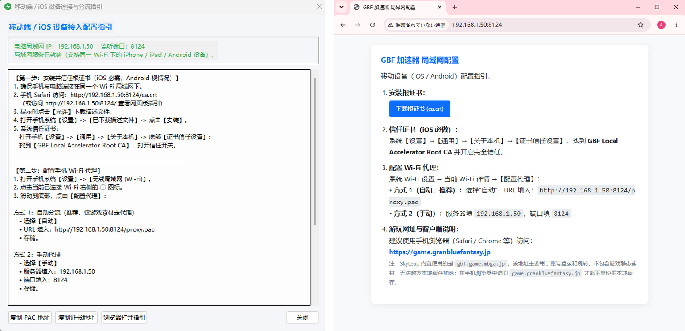

# GBF Accelerator

碧蓝幻想（Granblue Fantasy）高性能本地静态资源缓存与透明代理工具。

[](https://github.com/Sagisawa/GBF-Accelerator/releases)
[](https://www.python.org/)
[-informational.svg)]()
[]()
[](LICENSE)

通过本地 RAM / SSD 层次化缓存与 HTTP/2 多路复用连接，将游戏静态资源（立绘、音频、战斗动画、脚本）缓存至本地，减少跨海重复下载，降低静态素材加载延迟与上游带宽负载；同时为核心游戏动态 API（战斗、编队、抽卡、结算等）提供独立的 HTTP/1.1 长连接通道，实现业务语义零干预的端到端透明转发。

> 📥 **下载开箱即用版**：前往 [GitHub Releases](https://github.com/Sagisawa/GBF-Accelerator/releases) 获取预构建便携包：
> - **Windows**：下载 `GBF_Accelerator_v1.8.1_GUI.zip`，解压即用。
> - **macOS**：下载 `GBF_Accelerator_v1.8.1_macOS_universal2.zip`（Universal 2 双架构二进制包，同时原生支持 Intel 与 Apple Silicon Macs），解压即用。
> - 各版本详细改动请参阅 [CHANGELOG.md](CHANGELOG.md)。

<p align="center">
  
</p>

---

## 架构设计与数据流向

本工具在本地建立分流代理服务（默认端口 `8124`），对静态素材与动态 API 进行物理通道隔离：



<details>
<summary>点击查看 ASCII 字符流向图（无图形渲染时备用）</summary>

```text
Browser / Safari / AndApp / Steam
  │
  ▼ PAC 自动分流 (127.0.0.1:8124)
GBF Accelerator 本地代理核心
  │
  ├── [静态素材通道: asset_client] (HTTP/2 多路复用)
  │    ├── 1. RAM 内存缓存 ──[命中 0ms]──► 立即返回客户端
  │    ├── 2. SSD 磁盘缓存 ──[命中 1~3ms]──► 提入 RAM 并返回
  │    ├── 3. SingleFlight 并发合并 ──► 回源 Akamai CDN
  │    └── 调度保障: 原子落盘 + Magic Bytes 校验 + 预加载 15~35ms 抖动平滑
  │
  ├── [动态 API 通道: api_client] (HTTP/1.1 Keep-Alive 专用池)
  │    ├── 业务请求 (/rest/, /quest/...) ──► 端到端透明转发 (零 Header 篡改)
  │    ├── 官方探测 (/ob/r 与 /rest/error/js) ──► 100% 原样穿透
  │    └── 故障自愈: 只读接口安全断连重连 (POST/写请求严格零重试)
  │
  └── [上游网络出口调度]
       ├── 代理模式 (默认) ──► 上游代理软件 (Clash / v2rayN / 岛风GO)
       └── 直连模式 ─────────► Cygames 官方源站 / Akamai CDN
```
</details>

---

## 核心功能矩阵

### ⚡ 极速双通道与流控
- **动态 API / 静态素材双通道物理隔离**：
  - **动态 API 通道 (`api_client`)**：为 `game.granbluefantasy.jp` 专设独立 HTTP/1.1 连接池，保持长连接复用，避免连接反复握手延迟。
  - **静态素材通道 (`asset_client`)**：针对 Akamai CDN 启用 HTTP/2 多路复用，通过单条链路并发拉取多路素材切片。
  - **连接池互不影响**：后台预加载批量并发拉取素材时，动态 API 维持专属连接，避免与静态流量产生连接竞争。
- **前台素材优先调度与 QoS 避让**：
  - 动态跟踪前台活动请求，当前台拉取首屏与战斗画面素材时，后台预加载任务主动暂停让道；
  - 前台请求完毕后增加短时冷却平滑，避免后台预加载立即恢复引发瞬时突发流量。
- **安全失效重试 (Safe Stale-Retry)**：
  - **写请求严格零重试**：所有涉及状态变更的 POST 请求（普通攻击、技能释放、召唤、购买等）最大尝试次数严格为 1，杜绝重复触发。
  - **只读白名单断连重试**：仅对识别出的只读幂等 GET 接口（如 `/rest/multiraid/start.json`），在遇到底层空闲长连接断开（`ConnectError` / `RemoteProtocolError`）时执行最多 1 次快速重连。
- **低开销遥测与实时监控**：
  - 主界面提供实时日志窗口，直观高亮展示连接复用状态（`reused` / `new`）；
  - 记录 API 耗时分布（P50 / P95 / P99），支持按模块筛选与一键导出。

<p align="center">
  
</p>

### 💾 层次化缓存体系与预加载
- **RAM Cache 内存热点缓存**：高频静态资源直接驻留内存（默认上限 256MB，可在 16MB ~ 8192MB 范围自由调节），读取耗时接近 0ms，读取不经磁盘。
- **SSD 持久化缓存与原子写入**：静态资源落盘采用临时文件（`.tmp`）与原子替换（`os.replace` + `fsync`），防止写入意外中断导致文件残损。
- **Magic Bytes 二进制校验与一键体检**：校验 PNG / JPEG / WebP / GIF / MP3 / WOFF 等二进制文件头，拦截 0 字节损坏文件及 502/503 错误 HTML；GUI 提供“一键体检缓存”支持坏件清理与自动回源自愈。
- **SingleFlight 并发请求合并**：同名静态素材高并发请求时自动合并为单次回源拉取，其余请求共享返回结果，缓解上游并发压力。
- **后台平滑预加载 (Prefetch)**：解析场景 JS/JSON 及 CreateJS 角色动画切片，在任务间引入 15~35ms 随机抖动平滑调度，削峰填谷；引用扫描解耦至后台有界队列，不阻塞前台请求。
- **启动内存预热**：冷启动预热扫描上限优化为 1500 项，优先载入核心 JS/CSS、字体与高频 UI 图标，启动扫描耗时保持在 1.5 ~ 2.5 秒。
- **历史缓存平滑复用与兼容**：网络抖动或上游超时时，自动寻找本地已有旧版本静态资源平滑兜底，避免素材加载失败白屏；支持复用已有历史缓存目录（如 ACGPower 历史缓存）。

### 🖥️ 跨平台原生集成
- **Windows 原生集成**：
  - 原生控件风格界面，全面支持高 DPI 清晰渲染；
  - 自动管理 WinINet 系统 PAC 代理（启动自动挂载，退出自动清理）；
  - 支持最小化至系统托盘，后台运行时挂起界面定时器，CPU 占用降至接近 0.0%；
  - 内置 Windows 证书库信任管理（`certutil` 自动导入/注销）；
  - 支持随 Windows 开机自启（默认关闭）。
- **macOS 原生集成**：
  - 原生菜单栏（Menu Bar）顶部状态栏常驻图标与上下文菜单；
  - 自动调用 `networksetup` 托管系统 PAC 代理及绕过列表；
  - 自动调用 `security add-trusted-cert` 信任用户登录钥匙串（Keychain）；
  - 提供 `start_proxy.sh` 快捷启动与 `install_ca.sh` 一键证书管理；
  - 支持写入 LaunchAgents 用户自启服务。
- **Linux / 无头环境 (nogui)**：
  - 提供轻量化纯命令行模式运行（`python3 app_main.py`），适用于 Linux 虚拟机或无图形界面服务器；
  - 详细指引请参阅 [docs/MAC_LINUX_NOGUI.md](docs/MAC_LINUX_NOGUI.md)。
- **局域网共享与移动端支持**：
  - 可在设置中开启“允许局域网连接”，支持同一局域网下的 iPhone / iPad / Android 设备接入；
  - 内置私网 IP 访问控制列表（ACL）防护，提供移动端 PAC 配置与证书自动引导页面。

<p align="center">
  
</p>

- **客户端内置版本更新检测**：
  - 启动时异步比对 GitHub Releases 版本，支持根据操作系统（Windows / macOS）自动筛选对应发布包并提供一键下载与进度展示。

### 🛡️ 业务透明与安全治理规范
- **动态业务端到端透明直通 (Transparent API Pipeline)**：战斗、抽卡、结算与编队等核心动态请求由独立的 HTTP/1.1 Keep-Alive 连接池透明中继；严格遵循 RFC 代理传输规范，不读取、不拦截、不落盘任何身份鉴权凭证（Session / Cookie）与业务 Payload，原生无损保留上游业务状态码与多行会话凭证，保持标准的无状态透明网络中继。
- **静态素材字节级完整性 (Byte-for-Byte Integrity)**：本地磁盘与内存缓存的静态素材（立绘、音频、切片动画、脚本等）严格保真上游 Akamai CDN 的原始二进制字节流，杜绝任何代码注入或逻辑篡改。本地交付静态素材时仅依据 Web 协议标准补齐精准 MIME 类型、协商缓存（ETag）与 CORS 跨域标头（`Access-Control-Allow-Origin: *`），保障浏览器同源沙箱内的正常加载与渲染。
- **官方探测绝对穿透**：官方在线心跳（`/ob/r`）与前端错误上报（`/rest/error/js`）100% 穿透直达 Cygames 服务器，本地不拦截、不伪造。
- **响应头零指纹污染**：向客户端交付的所有响应中，严禁添加任何自定义代理标识头（如 `X-Proxy-*`、`X-Acceleration-*` 等），保持标准透明传输中间件定位。
- **本地独立唯一根证书**：根证书私钥仅在首次运行时由本机动态生成，严格保存在本地 `certs/` 目录，不使用任何硬编码或公开共享证书；域名证书通过 SAN 严格限制在 GBF 相关域名，符合 Apple TLS 规范（有效期 <= 365 天）。
- **精准收敛分流规则**：PAC 脚本精准收敛至 GBF 官方站点、标准 CDN 与 Steam 版 CDN，不通配公共 `*.akamaized.net`，不干扰非 GBF 流量。

---

## 快速上手

### 方式一：使用预构建便携版（推荐）

#### Windows 用户
1. 前往 [Releases 页面](https://github.com/Sagisawa/GBF-Accelerator/releases) 下载 `GBF_Accelerator_v1.8.1_GUI.zip`。
2. 解压到任意非中文路径（例如 `D:\GBF_Accelerator\`）。
3. 确保你的上游代理（Clash Verge / v2rayN 等）已开启并正常联网。
4. 双击运行 `GBF_Accelerator.exe`。
5. 检查上游代理端口与本地端口（默认 `8124`），勾选“自动配置系统 PAC 代理”，点击“启动加速”。
6. 在浏览器中打开游戏页面即可正常游玩。

#### macOS 用户
1. 前往 [Releases 页面](https://github.com/Sagisawa/GBF-Accelerator/releases) 下载 `GBF_Accelerator_vX.Y.Z_macOS_universal2.zip`（例如当前版本 `GBF_Accelerator_v1.8.1_macOS_universal2.zip`，Universal 2 双架构二进制独立 `.app`，同时原生支持 Intel 与 Apple Silicon Macs）。
2. 解压并打开应用程序（若提示签名拦截，请参考 [常见问题 FAQ](#q3-macos-提示应用程序已损坏无法打开或被-gatekeeper-拦截)）。
3. 确保 Clash / Surge 等上游代理正常运行。
4. 启动后程序会常驻顶部 Menu Bar 菜单栏；若首次使用，可根据提示完成钥匙串根证书信任。
5. 点击“启动加速”，系统 PAC 代理将自动挂载，即可在 Safari 或 Chrome 中开始游戏。

---

### 方式二：从源码运行

#### 环境要求
- **Python 3.10+**（推荐 3.11 / 3.12）
- Windows 10/11 或 macOS 12+ 或 Linux

#### Windows 源码运行
```powershell
# 1. 克隆代码仓库
git clone https://github.com/Sagisawa/GBF-Accelerator.git
cd GBF-Accelerator

# 2. 创建并激活 Python 虚拟环境
python -m venv .venv
.\.venv\Scripts\activate

# 3. 安装依赖
pip install -r requirements.txt

# 4. 运行图形界面
python gui_main.py
```

#### macOS 源码运行
```bash
# 1. 克隆代码仓库
git clone https://github.com/Sagisawa/GBF-Accelerator.git
cd GBF-Accelerator

# 2. 创建并激活 Python 虚拟环境
python3 -m venv .venv
source .venv/bin/activate

# 3. 安装依赖
pip install -r requirements.txt

# 4. 首次使用安装/信任本地根证书
./install_ca.sh

# 5. 启动程序 (GUI 界面)
./start_proxy.sh
# 或直接运行: python3 gui_main.py
```

#### Linux / 无头服务器运行 (nogui)
在无桌面环境的 Linux 服务器或容器中，可使用纯命令行模式：
```bash
python3 app_main.py
```
> 详细的环境依赖、`libnss3-tools` 证书导入与浏览器配置步骤，请参阅专用指南：[docs/MAC_LINUX_NOGUI.md](docs/MAC_LINUX_NOGUI.md)。

---

## 配置文件说明

首次运行后会在程序根目录下生成 `config.json`，可在图形界面中配置，也可直接编辑：

```json
{
  "listen_host": "127.0.0.1",
  "listen_port": 8124,
  "allow_lan": false,
  "upstream_proxy": "auto",
  "direct_mode": false,
  "cache_dir": "auto",
  "clean_zombies": true,
  "auto_system_proxy": true,
  "auto_start": false,
  "enable_ram_cache": true,
  "ram_cache_max_mb": 256,
  "enable_browser_cache": true,
  "enable_auto_repair": true,
  "enable_prefetch": true,
  "enable_ram_warmup": true,
  "ram_warmup_max_items": 1500,
  "verify_upstream_tls": true,
  "shimakaze_mode": false,
  "auto_check_update": true,
  "api_max_connections": 16,
  "api_max_keepalive": 4,
  "api_keepalive_expiry": 20.0,
  "asset_max_connections": 100,
  "asset_max_keepalive": 40,
  "asset_keepalive_expiry": 60.0,
  "enable_api_telemetry": true
}
```

| 配置项 | 类型 | 默认值 | 说明 |
| :--- | :--- | :--- | :--- |
| `listen_host` | 字符串 | `"127.0.0.1"` | 本地监听地址；需局域网其他设备访问时设为 `"0.0.0.0"`。 |
| `listen_port` | 整数 | `8124` | 本地代理监听端口（可按需自定义）。 |
| `allow_lan` | 布尔 | `false` | 是否允许局域网内其他设备接入加速服务。 |
| `upstream_proxy` | 字符串 | `"auto"` | 上游代理地址；`"auto"` 自动探测 7897/7890/10808/10809 端口，也可指定为 `"http://127.0.0.1:7897"` 等。 |
| `direct_mode` | 布尔 | `false` | 直连模式；开启后绕过上游代理直接请求，但本地静态缓存继续生效。 |
| `cache_dir` | 字符串 | `"auto"` | 静态素材磁盘落盘目录；`"auto"` 自动检测已有 ACGPower 缓存或使用程序目录下的 `cache/gbf/https`。 |
| `clean_zombies` | 布尔 | `true` | 启动时自动检查并清理因异常退出残留的历史孤儿代理进程。 |
| `auto_system_proxy` | 布尔 | `true` | 点击“启动加速”时是否自动挂载系统 PAC 代理（Windows WinINet / macOS networksetup）。 |
| `auto_start` | 布尔 | `false` | 是否随系统开机自启并最小化（默认关闭）。 |
| `enable_ram_cache` | 布尔 | `true` | 是否启用 RAM 内存热点缓存。 |
| `ram_cache_max_mb` | 整数 | `256` | RAM 缓存容量上限（MB），支持范围 16 ~ 8192。 |
| `enable_browser_cache` | 布尔 | `true` | 是否对带版本哈希的静态资源注入 `immutable` 强缓存标头。 |
| `enable_auto_repair` | 布尔 | `true` | 自动检测并清理损坏/0字节的静态资源缓存并回源修复。 |
| `enable_prefetch` | 布尔 | `true` | 启用后台资源平滑预加载（15~35ms 抖动调度，前台活动主动让道）。 |
| `enable_ram_warmup` | 布尔 | `true` | 启动时是否预热高频静态素材至 RAM 缓存。 |
| `ram_warmup_max_items` | 整数 | `1500` | 启动预热扫描素材数量上限，平衡启动耗时与热点命中。 |
| `verify_upstream_tls` | 布尔 | `true` | 请求上游时是否校验 TLS 证书安全性。 |
| `shimakaze_mode` | 布尔 | `false` | 岛风 GO 兼容优化模式（适配其证书与超时参数）。 |
| `auto_check_update` | 布尔 | `true` | 启动时是否自动检查 GitHub Releases 最新版本。 |
| `api_max_connections` | 整数 | `16` | 动态 API 专属连接池最大连接数。 |
| `api_max_keepalive` | 整数 | `4` | 动态 API 连接池空闲长连接保留数。 |
| `api_keepalive_expiry` | 浮点 | `20.0` | 动态 API 空闲长连接保活超时（秒）。 |
| `asset_max_connections` | 整数 | `100` | 静态素材通道最大并发连接数（HTTP/2 多路复用，推荐保守水线 <= 32）。 |
| `asset_max_keepalive` | 整数 | `40` | 静态素材通道空闲长连接保留数（推荐保守水线 <= 16）。 |
| `asset_keepalive_expiry` | 浮点 | `60.0` | 静态素材通道空闲长连接保活超时（秒）。 |
| `enable_api_telemetry` | 布尔 | `true` | 是否启用 API 响应耗时分布（P50/P95/P99）及连接复用率遥测。 |

---

## 常见问题排查 (Practical FAQ)

### Q1: 浏览器打开游戏页面提示“证书不受信任”或 `NET::ERR_CERT_AUTHORITY_INVALID`？
- **原因**：本地代理需要对 HTTPS 静态资源进行本地缓存分流，首次使用时需要信任本机独立生成的根证书。
- **排查与解决**：
  - **Windows 用户**：
    1. 在图形界面点击【安装根证书】按钮，在弹出的 Windows 安全警告窗口中点击【是】；
    2. 或右键管理员身份运行根目录下的 `install_ca.bat`；
    3. **务必完全退出并重启浏览器**（关闭所有窗口并重新打开，使浏览器重载系统证书信任库）。
  - **macOS 用户**：
    1. 运行根目录下的 `./install_ca.sh`，脚本会自动导入至当前用户登录钥匙串并设置信任；
    2. 若系统提示输入密码，请输入 Mac 开机密码以完成授权；
    3. 在 Chrome / Safari 中按 `Cmd + Q` 完全退出浏览器后重新打开。
  - **Firefox 用户**：Firefox 采用独立证书库，需在 Firefox【设置】→【隐私与安全】→【证书】→【查看证书】→【证书颁发机构】中导入 `certs/ca.crt`，并勾选“信任由此证书颁发机构标识的网站”。

### Q2: 上游代理（Clash / v2rayN / 岛风GO）端口如何配置？“自动探测”未找到怎么办？
- **常见上游代理默认端口**：
  - Clash Verge (Rev): `7897`
  - Clash for Windows / 标准 Clash: `7890`
  - v2rayN: `10809` (HTTP) / `10808` (SOCKS5)
  - 岛风GO: `8099` (HTTP)
- **手动设置**：在主界面【上游代理端口】输入框中填入你所使用的代理客户端对应端口（例如 `7897`）。
- **测试连通性**：点击【测试连通性】或【上游延迟】按钮，确认往返延迟正常。如果测试失败，请检查代理客户端是否正常启动并处于开启系统代理或服务模式。
- **直连场景**：若身处海外网络或直连延迟优良，可直接勾选【直连模式】，程序将跳过上游代理直接请求服务器，同时保留本地静态缓存。

### Q3: macOS 提示“应用程序已损坏，无法打开”或被 Gatekeeper 拦截？
- **原因**：macOS Gatekeeper 会对未经过 Apple 开发者签名的开源分发包附加隔离属性（Quarantine Attribute）。
- **解决方法**：
  打开终端（Terminal），执行以下命令清除隔离属性：
  ```bash
  # 若已移动到“应用程序”目录：
  sudo xattr -cr /Applications/GBF_Accelerator.app

  # 若解压在“下载”目录：
  xattr -cr ~/Downloads/GBF_Accelerator.app
  ```
  或者按住 `Control` 键点击应用程序图标，在右键菜单中选择【打开】，并在系统确认对话框中点击【打开】即可。

### Q4: 如何复用 ACGPower 或旧版本加速器的历史缓存？
- **自动识别**：GBF Accelerator 启动时会自动扫描常见路径下的 ACGPower 缓存目录（如 `D:\acgpower\cache\gbf\https`），若找到会自动提示一键切换复用。
- **手动指定**：
  1. 在主界面【缓存目录】点击【浏览】；
  2. 选择你原本存放 ACGPower 或旧版本缓存的根目录或 `https` 目录；
  3. 程序会自动标准化路径并挂载，无需重复跨海下载数十 GB 的静态素材文件。
- **缓存健康检查**：若历史缓存中存在损坏或不完整文件，可点击主界面的【一键体检缓存】按钮，程序将通过 Magic Bytes 文件头校验快速扫描并隔离异常文件，随后在游戏需要时自动重新拉取正确版本。

### Q5: 手机或 iPad 等移动设备如何连接本地加速？
1. 确保手机/平板与运行加速器的电脑处于**同一局域网（同一 Wi-Fi）**。
2. 在电脑端图形界面中勾选【允许局域网连接】。
3. 获取电脑在局域网中的 IP 地址（例如 `192.168.1.100`）。
4. 在手机 Wi-Fi 设置中，找到当前连接的 Wi-Fi 并配置代理：
   - **方式一（推荐，PAC 自动代理）**：选择【自动】，URL 填写 `http://192.168.1.100:8124/proxy.pac`。
   - **方式二（手动代理）**：选择【手动】，服务器填写 `192.168.1.100`，端口填写 `8124`。
5. 在手机浏览器中访问 `http://192.168.1.100:8124/ca.crt` 下载并安装根证书，并在系统【通用】→【关于本机】→【证书信任设置】中开启对该证书的完全信任。

---

## 开发与构建

### 运行测试套件
项目配备了严谨的回归测试套件（75 项核心代理测试与 10 项更新管理测试，共 85 项自动化测试），涵盖双通道隔离、SingleFlight 合并、只读失效重试、Magic Bytes 校验、进程单例防重与跨平台更新逻辑：
```powershell
# Windows
.\.venv\Scripts\python.exe test_proxy.py
.\.venv\Scripts\python.exe test_update_manager.py

# macOS / Linux
python3 test_proxy.py
python3 test_update_manager.py
```

### 打包为独立可执行文件 / 应用程序

- **Windows**（打包为单个独立可执行文件）：
  ```bash
  python build_exe.py
  ```
  打包完成后，可执行文件位于 `dist/GBF_Accelerator.exe`，发布包位于 `release/GBF_Accelerator_vX.Y.Z_GUI.zip`。

- **macOS**（打包为 Universal 2 双架构 `.app` 应用程序）：
  ```bash
  python build_app.py
  ```
  打包完成后，应用程序位于 `dist/GBF_Accelerator.app`，发布包位于 `release/GBF_Accelerator_vX.Y.Z_macOS_universal2.zip`，原生双兼容 Apple Silicon（M系列）与 Intel 芯片。

---

## 安全与技术说明

- **根证书本地隔离管理**：本机根证书仅在首次运行时本地生成，私钥严格保存在本地 `certs/` 目录不外泄。主界面实时展示证书的 SHA-256 指纹，并提供注销/卸载根证书功能，方便随时清理受信任根证书。
- **精准域名分流控制**：PAC 脚本及代理路由严格限制为 GBF 主站域名、标准版 CDN 与 Steam 版专用 CDN（`prd-game-a*-granbluefantasy-steam.akamaized.net`），不通配公共 `*.akamaized.net`，不接管非 GBF 流量。
- **缓存原子落盘与完整性校验**：静态资源下载采用临时文件（`.tmp`）及原子替换（`os.replace` + `fsync`），防止写入意外中断产生损坏文件；通过文件头校验拦截伪装成静态资源的错误 HTML 响应。
- **动态 API 零干预中继与心跳穿透**：所有动态接口（抽卡、战斗结算、`/ob/r` 在线探测、`/socket/` 多人战等）均端到端透明直通官方源站，零凭证触碰、零 Payload 篡改、无任何本地 Mock 伪造。
- **免责声明**：本软件为开源网络辅助与本地静态资源缓存工具，不篡改任何游戏数据、前端脚本或内存。请遵守 Cygames 最终用户许可协议，使用风险自负。
